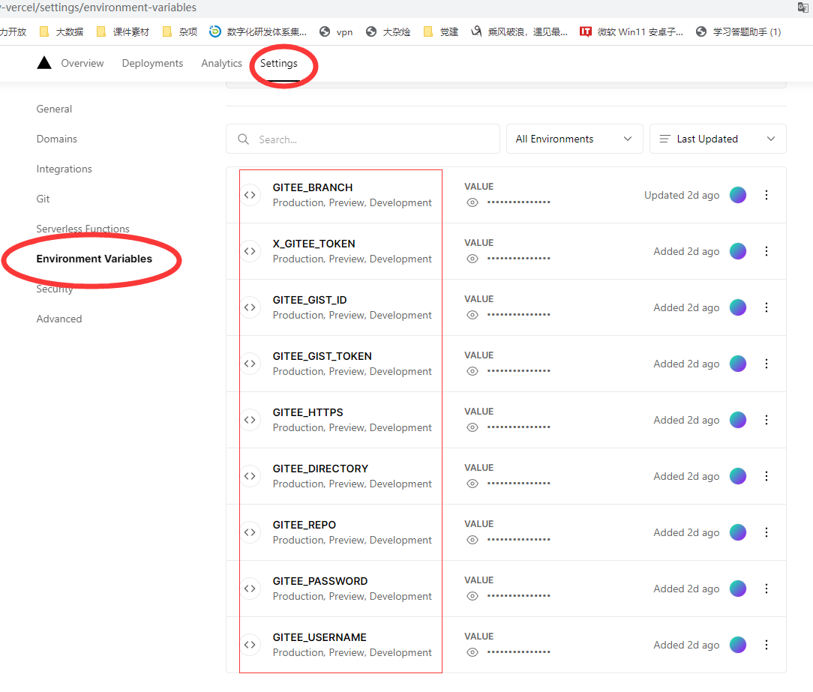
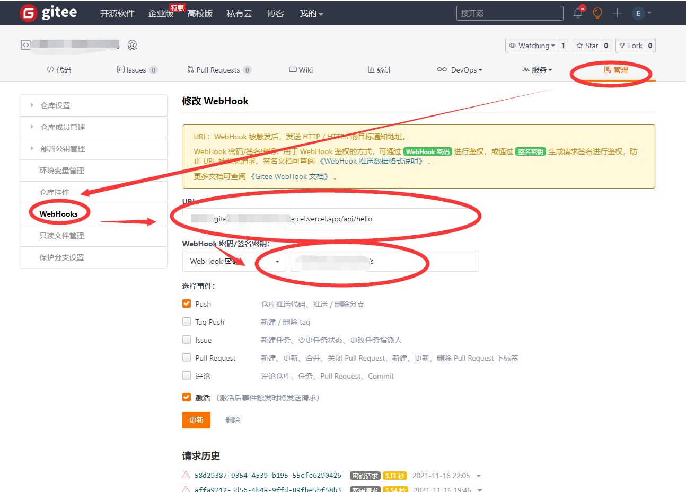
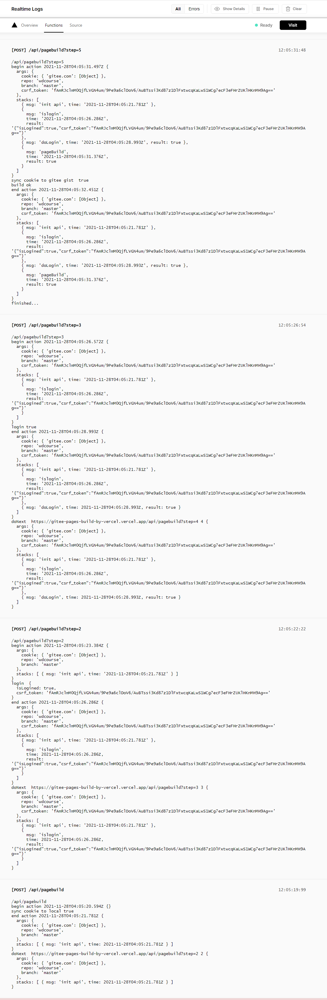

# gitee-pages-build-by-vercel
update pages by webhook and vercel 

设置Gitee的Webhooks 到Vercel.com 网站后，因为API只能运行10秒，许多任务没有办法正常完成。为了突破限制，技术上采用多次请求来完成任务，8+8+8等， 达到24秒以上。

## 使用说明
1. 先注册Vercel.com

2.  然后Fork我的项目  https://github.com/evlon/gitee-pages-build-by-vercel.git

3.  Vercel 导入项目，配置环境变量 ，配置修改后记得重新部署。 见附图1
```
GITEE_USERNAME=your name
GITEE_PASSWORD=your password
GITEE_REPO=your repo
GITEE_BRANCH=your branch
GITEE_DIRECTORY=/
GITEE_HTTPS=1
GITEE_GIST_TOKEN=tokenstring
GITEE_GIST_ID=gist_id

X_GITEE_TOKEN=gitee web hook token

```
4. 验证一下， https://your-vercel-domain.vercel.app/api/pagebuild ， 如果返回 
` {"msg":"access not allowd."} `  说明程序OK。 

5. 登录Gitee的仓库，配置web hook . 见图2. 其中 “Web hook 密码” == X_GITEE_TOKEN 

6. 在Gitee上新建一个代码片段，更新配置项：GITEE_GIST_ID ，并生产私人秘钥， 更新配置项 GITEE_GIST_TOKEN。 这个可以不用总是每次登录你的Gitee , 具体参照 https://github.com/evlon/gitee-pages-build 

7. 提交一个测试一下吧。

## 附图
1. Vercel
   
2. Gitee
   
3. Vercel function log
   
